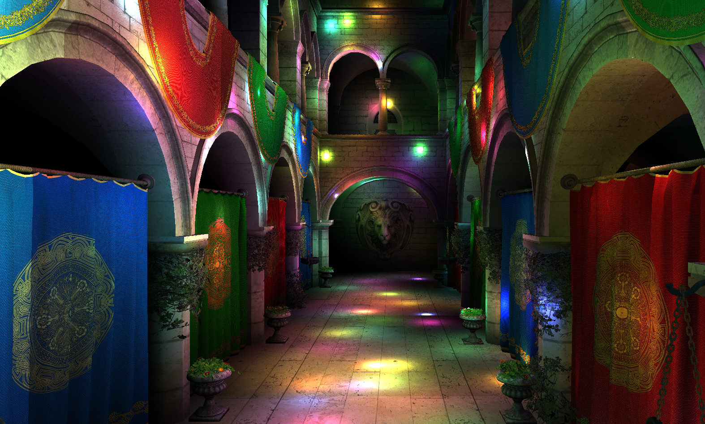
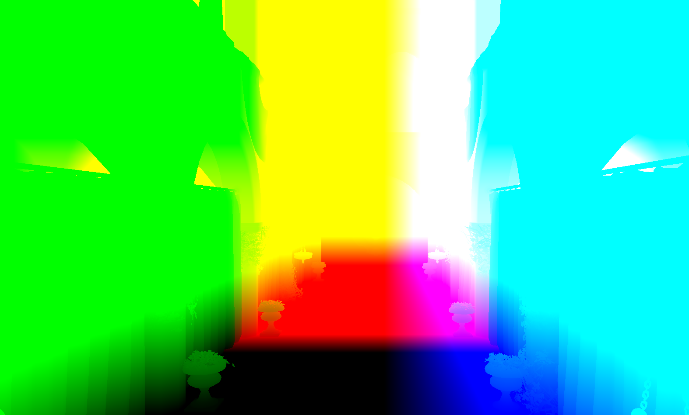
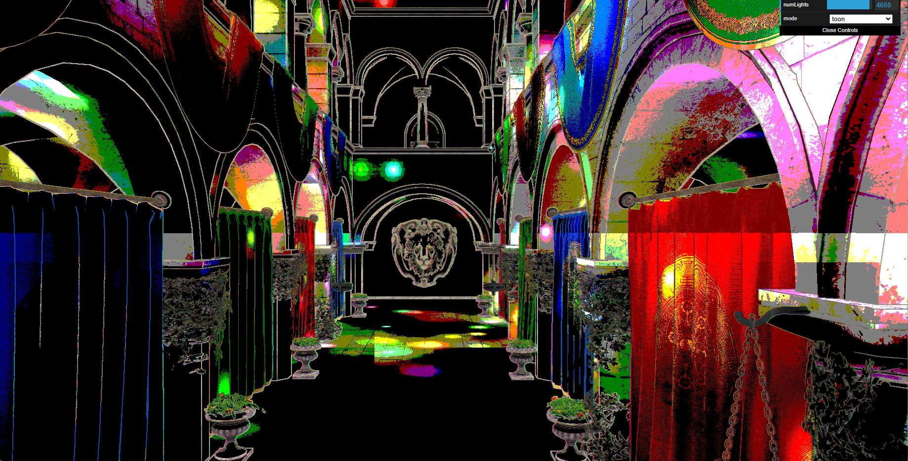

WebGL Forward+ and Clustered Deferred Shading
======================

**University of Pennsylvania, CIS 565: GPU Programming and Architecture, Project 4**

* Jacqueline (Jackie) Li
  * [LinkedIn](https://www.linkedin.com/in/jackie-lii/), [personal website](https://sites.google.com/seas.upenn.edu/jacquelineli/home), [Instagram](https://www.instagram.com/sagescherrytree/), etc.
* Tested on: : Chrome/141.0.7390.67, : Windows NT 10.0.19045.6332, 11th Gen Intel(R) Core(TM) i7-11800H @ 2.30GHz, NVIDIA GeForce RTX 3060 Laptop GPU (6 GB)

### Live Demo

[Demo link](https://sagescherrytree.github.io/Project4-WebGPU-Forward-Plus-and-Clustered-Deferred-2025/)

### Demo Video/GIF

## Project Overview

This project features a WebGPU implementation of the naive, forward+, and clustered deferred shading techniques, and how they affect the rendering pipeline.

### Naive Shading Technique

The naive shading technique implements the standard method for a rendering pipeline, but on WebGPU. This method sets up a view projection matrix for the camera which then gets written to a GPU buffer, along with an array of lights that all get passed to the shaders. In the fragment shader, each light's influence on the scene is then calculated per fragment, resulting in significantly reduced efficiancy for a higher volume of lights, as exhibited by the .gif below. Essentially, as the number of lights increase, the naive method runs exponetially slower.

### Forward+ Shading Technique

The forward+ shading technique is the first optimisation improvement to the naive method, in which the crux of the improvement comes from using clusters of lights to pass to the GPU to parallelise the calculations, instead of iterating and accumulating through each fragment. This requires the creation of another buffer to hold light clusters, which also gets passed to the GPU in a similar format as the array of lights (an array of clusters).

The brunt of the forward+ rendering technique derives from splitting up the scene into clusters, as mentioned before. Below is a breakdown in steps on how exactly the clusters, shaped like elongated cubes in the view frustrum, are calculated and passed into the compute shader as clusters.

|  |  |  |  |
|:--:|:--:|:--:|:--:|
| Step 1: Divide view frustrum into grids, which are actually just cubes. Cubes will then become clusters. | Step 2: Use intersection test to assign lights. | Step 3: Result of Step 2 for all objects, finish compute shader execution. | Step 4: Shade each object for each light in each cluster. |
|:--:|
| Reference: [A Primer on Efficient Rendering Algorithms and Clustered Shading](https://www.aortiz.me/2018/12/21/CG.html) |

#### Step 1

Divide the view frustrum (in screenspace) into a grid, which really translates to elongated trapezoidal prisms originating from the camera. These will be classified as the clusters, in which we will be assigning lights to. 

#### Step 2

In the compute shader (clustering.cs.wgsl), use AABB intersection on each light to assign lights to the cluster sets that are being passed to the shader. In order to perform each intersection though, as the cluster shape is irregular, we first convert the points of the cluster (in screenspace) to NDC space to obtain the shape of a cube, then to view space for its position in the 3D scene. To obtain each slice's depth, I referenced [this blog](https://github.com/DaveH355/clustered-shading) which describes an exponential division method along the z of the view frustrum to cover more area with less dimensions for each cluster.

|  |
|:--:|
| Exponential division method of calculating clusters. |

#### Step 3

In the main loop of the compute shader (clustering.cs.wgsl), we iterate through the passed in lights array and assign each light to each cluster based on its shown intersections.

#### Step 4

Finally, in the fragment shader (forward_plus.fs.wgsl), access the cluster that the current fragment is situated in, then render each portion of the scene that is within the cluster by iterating through each light and calculating its accum value. This will result in faster runtime at a larger volume of lights, as now rendering can occur in parallel, instead of having to calculate the influences iteratively like in naive.

|  |
|:--:|
| A visualisation of the clusters in scene. |

#### A Small Notice on the Forward+ Technique in Regards to Light Cluster Size

Using the NVidia GeForce RTX 3060 GPU, my forward+ render at 500 lights and cluster size of 1024 actually seems visually slower than naive method with the same settings.

This is rendered with the following settings for variables:

- [x] computeClustersWorkgroupSize: [4,4,4]
- [x] maxLightsInCluster: 1024

For an additional test, I changed these values:

- [x] computeClustersWorkgroupSize: [8,8,4]
- [x] maxLightsInCluster: 128

These are the parameters that are used in the demo video.

It seemed that reducing the maximum lights and increasing the workgroup size made processing each cluster faster, making forward+ run faster than naive, as it should be. However, it also must be noted that changing the dimensions of the cluster work group size, the cluster dimensions themselves, and the maximum number of lights in each cluster needs to be proportional with each other, or some artifacting will occur on the cluster pass. 

### Clustered Deferred Shading Technique

|  |
|:--:|
| Clustered deferred method, 3838 lights |

As further optimisation on top of forward+ technique, the clustered deferred technique still uses the clusters calculated from the forward+ method earlier. However, instead of directly rendering each light's influence, the position, albedo, and normal of the scene are generated into buffers and are passed into a "geometry" buffer, which then a fullscreen pass reads from and calculates lighting from that data.

|  |  |  |
|:--:|:--:|:--:|
| Position Buffer | Albedo Buffer | Normal Buffer |

Above are each of the buffer informations that get saved in textures in the "geometry" buffer pass (clustered_deferred.fs.wgsl). These pieces then will be used in the subsequent lighting calculation on the fragment shader (clustered_deferred_fullscreen.fs.wgsl).

### Toon Shading

|  |
|:--:|
| Clustered deferred method with custom toon shader, 4650 lights |

I added a toon shader as an extra, more personal addition to the clustered deferred shading method (clustered_deferred_toon.fs.wgsl). For the toon shader, I added a simple shader based on a number of levels (I have mine set at 3 for the time being) and using that I partition the throughput accumulation into different values. Below are results of different levels of the toon shader. 

|  |  |  |
|:--:|:--:|:--:|
| Toon levels: 2 | Toon levels: 3 | Toon levels: 6 |

I also implemented a simple outlines function, which is simply a sobel kernel based edge detection function, which I then added some personal stylisation to by sampling the albedo texture for the colour and offsetting it for detected edges.

The final result of this simple stylisation shader can be viewed below.

## Performance Analysis

### Optimisations in Forward+ Shading 

1. Exponential division of clusters helps in creating smaller clusters closer to camera, which means those clusters have fewer cameras, therefore increasing performance because there are fewer lights to calculate for more complex objects within each fragment.

2. Clusters themselves are an optimisation from the iterative method of calculating influence for each light in the entire scene. This is because as a fragment shader runs on each pixel simultaneously, having only for each execution access a specific subset of lights to calculate over would be significantly faster than the naive method which would be calculating the influence for all the lights in the scene. 

### Optimisations in Clustered Deferred Shading

1. Only visible fragments are computed as we read from the visual information from the buffers that take information from the camera instead of the entire global 3D scene. This eliminates many unnecessary draw calls to render occluded places that will not be shown to the camera, thereby once again improving performance.

### Credits

- [Vite](https://vitejs.dev/)
- [loaders.gl](https://loaders.gl/)
- [dat.GUI](https://github.com/dataarts/dat.gui)
- [stats.js](https://github.com/mrdoob/stats.js)
- [wgpu-matrix](https://github.com/greggman/wgpu-matrix)
