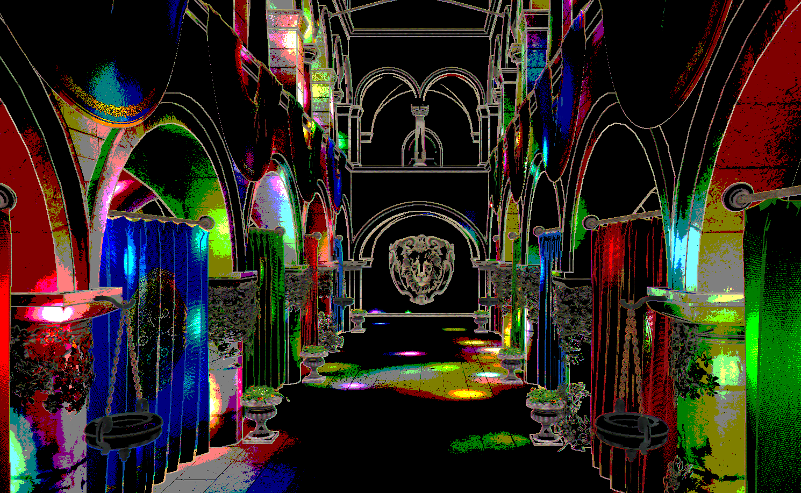

WebGL Forward+ and Clustered Deferred Shading
======================

**University of Pennsylvania, CIS 565: GPU Programming and Architecture, Project 4**

* Jacqueline (Jackie) Li
  * [LinkedIn](https://www.linkedin.com/in/jackie-lii/), [personal website](https://sites.google.com/seas.upenn.edu/jacquelineli/home), [Instagram](https://www.instagram.com/sagescherrytree/), etc.
* Tested on: : Chrome/141.0.7390.67, : Windows NT 10.0.19045.6332, 11th Gen Intel(R) Core(TM) i7-11800H @ 2.30GHz, NVIDIA GeForce RTX 3060 Laptop GPU (6 GB)

### Live Demo

[Demo link](https://sagescherrytree.github.io/Project4-WebGPU-Forward-Plus-and-Clustered-Deferred-2025/)

### Demo Video/GIF

### Project Overview

This project features a WebGPU implementation of the naive, forward+, and clustered deferred shading techniques, and how they affect the rendering pipeline.

### Naive Shading Technique

The naive shading technique implements the standard method for a rendering pipeline, but on WebGPU. This method sets up a view projection matrix for the camera which then gets written to a GPU buffer, along with an array of lights that all get passed to the shaders. In the fragment shader, each light's influence on the scene is then calculated per fragment, resulting in significantly reduced efficiancy for a higher volume of lights, as exhibited by the .gif below. Essentially, as the number of lights increase, the naive method runs exponetially slower.

### Forward+ Shading Technique

The forward+ shading technique is the first optimisation improvement to the naive method, in which the crux of the improvement comes from using clusters of lights to pass to the GPU to parallelise the calculations, instead of iterating and accumulating through each fragment. This requires the creation of another buffer to hold light clusters, which also gets passed to the GPU in a similar format as the array of lights (an array of clusters).

[Insert breakdown of forward+ technique using concept imgs from slides + buffer outputs.]

#### A Small Notice on the Forward+ Technique in Regards to Light Cluster Size

Using the NVidia GeForce RTX 3060 GPU, my forward+ render at 500 lights and cluster size of 1024 actually seems visually slower than naive method with the same settings.

This is rendered with the following settings for variables:

- [x] computeClustersWorkgroupSize: [4,4,4]
- [x] maxLightsInCluster: 1024

For an additional test, I changed these values:

- [x] computeClustersWorkgroupSize: [8,8,4]
- [x] maxLightsInCluster: 128

These are the parameters that are used in the demo video.

It seemed that reducing the maximum lights and increasing the workgroup size made processing each cluster faster, making forward+ run faster than naive, as it should be. However, it also must be noted that changing the dimensions of the cluster work group size, the cluster dimensions themselves, and the maximum number of lights in each cluster needs to be proportional with each other, or some artifacting will occur on the cluster pass. 

## Performance Analysis

### Credits

- [Vite](https://vitejs.dev/)
- [loaders.gl](https://loaders.gl/)
- [dat.GUI](https://github.com/dataarts/dat.gui)
- [stats.js](https://github.com/mrdoob/stats.js)
- [wgpu-matrix](https://github.com/greggman/wgpu-matrix)
